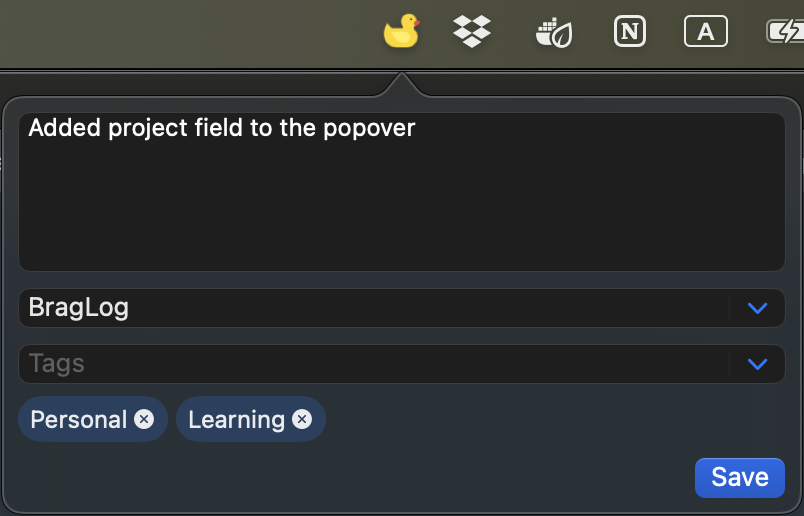

# BragLog (macOS)

A tiny **menu-bar work log**: capture what you did (with optional tags and project) so it’s easy to surface later for performance reviews, CVs, etc. All data stays local in a SQLite database.

You also get a little fellow [duck to talk to](https://rubberduckdebugging.com/) in the menu bar so your debugging buddy is always in sight.

> Inspired by:
> - [Don't Do Invisible Work](https://www.youtube.com/watch?v=HiF83i1OLOM) - Chris Albon
> - [A Work Log Template for Software Engineers](https://blog.pragmaticengineer.com/work-log-template-for-software-engineers/) - The Pragmatic Engineer Blog (Gergely Orosz)
> - [Get your work recognized: write a brag document](https://jvns.ca/blog/brag-documents/) - Julia Evans' Blog

## Disclaimer

This is an app I built for personal use. It’s not intended for distribution (no App Store / notarization / support). If you want it, the expectation is that you build it yourself from source.

## Build & install (Xcode)

1. **Clone the repo**
2. **Open** `BragLog/BragLog.xcodeproj` in Xcode
3. (Recommended) **Set build configuration to Release**  
   `Product -> Scheme -> Edit Scheme... -> Run -> Build Configuration -> Release`
4. **Build**  
   `Product -> Build`
5. **Show build folder**  
   `Product -> Show Build Folder in Finder`
6. **Install the app**
   - In Finder, go to `Products/Release`
   - Move `BragLog.app` to `/Applications`
7. **Launch**
   - Open it from `/Applications`, or via **Spotlight Search**
   - You can also **keep it in the Dock** for quick access

## Data & database import

- **Storage**: Log rows are stored in a local SQLite database at  
  `~/Library/Application Support/BragLog/log.db`
- **Access**: You can open `log.db` with any SQLite DB client, then process the data with your own scripts to generate whatever format you need (performance reviews, CVs, summaries, etc.).
- **Import DB** (in-app): Replaces the current database file with a `.db` you select.
  - Before replacing, it **backs up** the current DB in the same directory (timestamped, e.g. `log.db.backup.YYYYMMDD-HHMMSS`)
  - Then it **copies the selected DB** into place as `log.db`
